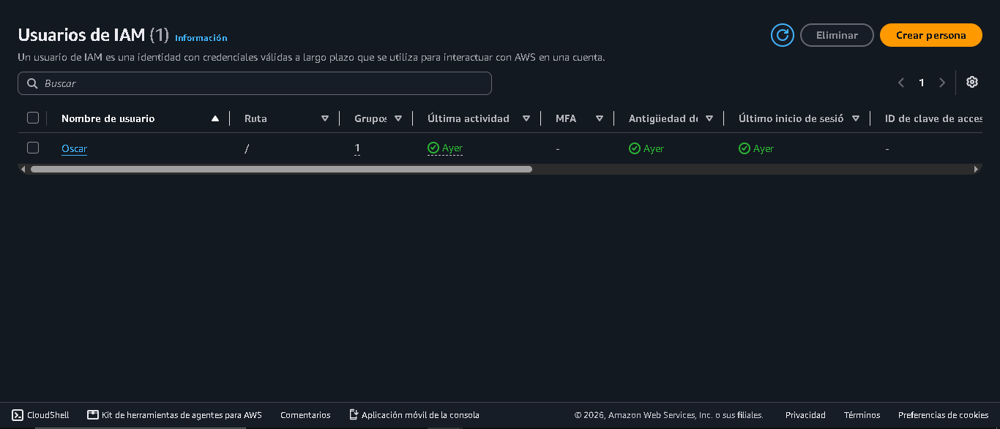
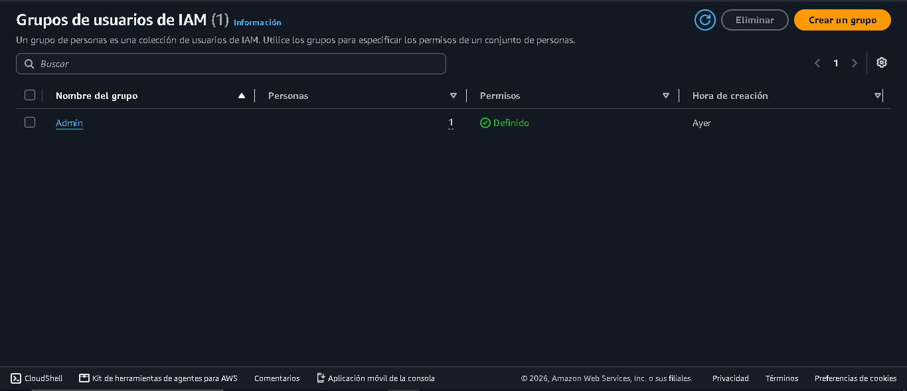
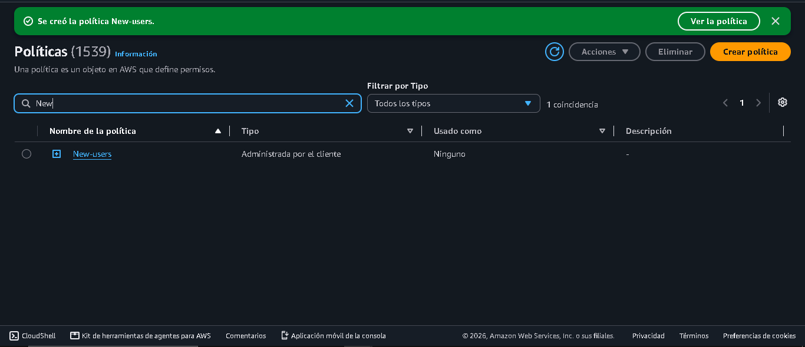

#  Lab Evidence

## Overview

This document contains the evidence of the tasks completed during the IAM User Management lab.

The screenshots included demonstrate the configuration and successful execution of AWS IAM and AWS CLI tasks.

---

# IAM User Creation

A new IAM user was created successfully.

Evidence:



---

# IAM Group Configuration

An IAM group was created and permissions were assigned.

Evidence:



---

# IAM Policy Assignment

AWS managed policies were attached to provide the required permissions.

Evidence:



---

# AWS CLI Configuration

AWS CLI was configured and the authentication was verified.

Command used:

```bash
aws sts get-caller-identity
```

Evidence:


---

## Security Considerations

Sensitive information such as Access Keys and Secret Access Keys was not included in this repository.
