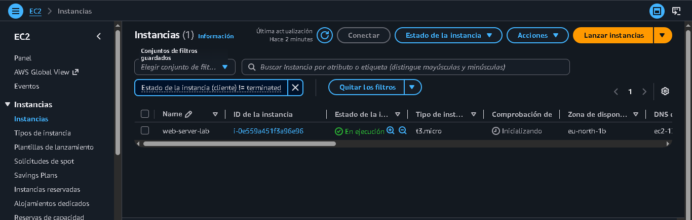

# EC2 Web Server Evidence

## 1. EC2 Instance Created

Amazon EC2 instance successfully deployed.

---

## 2. SSH Connection

Successful SSH connection to the EC2 instance.

---

## 3. Web Server Running

Apache web server successfully deployed.

