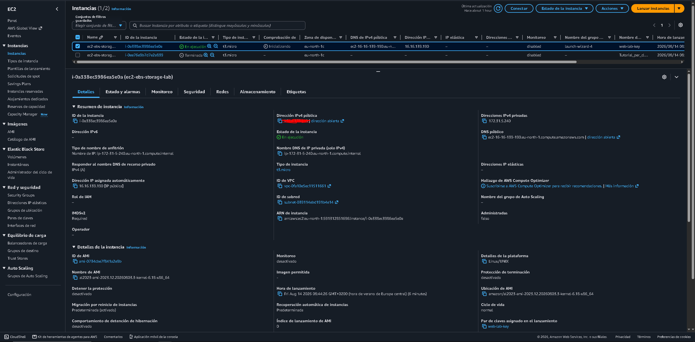
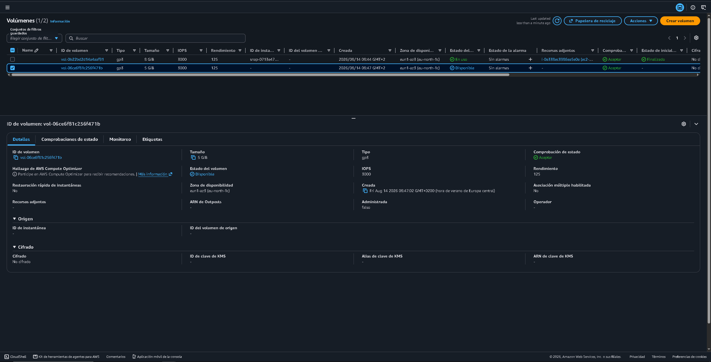
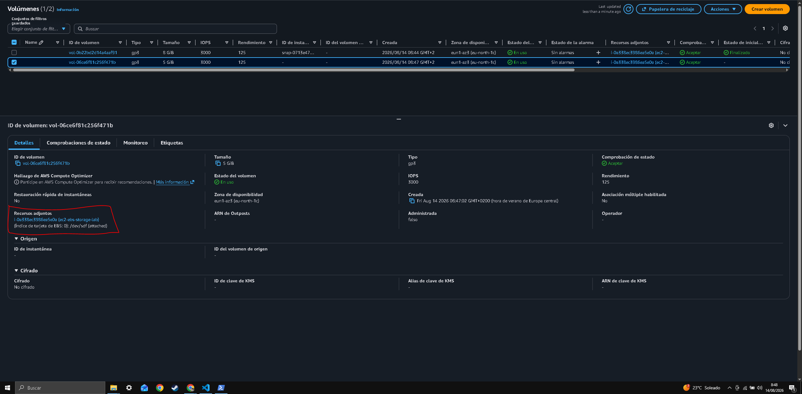
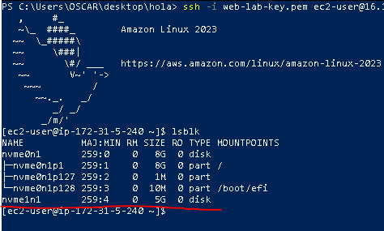
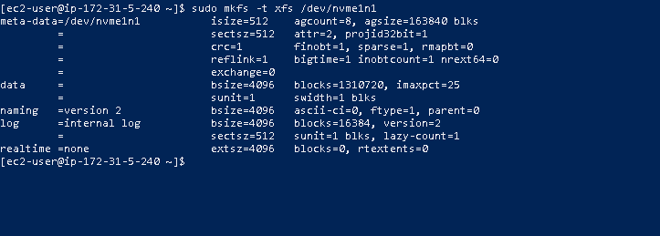
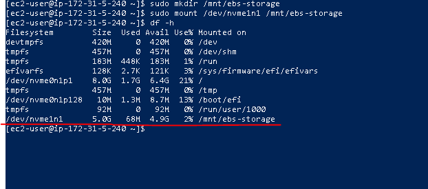
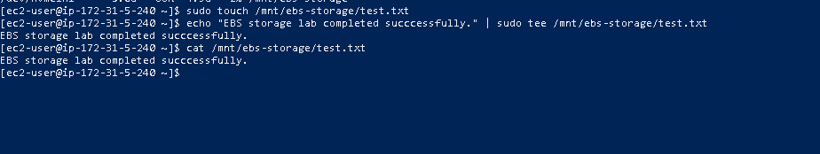
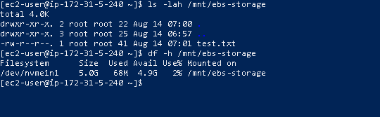

# Evidence

This section documents the practical steps completed during the EBS storage lab.

## EC2 Instance

EC2 instance successfully created for the lab.

## EBS Volume

A 5 GiB gp3 EBS volume was successfully created.

## EBS Attachment

The EBS volume was successfully attached to the EC2 instance.

## Disk Detection

The Linux operating system successfully detected the attached EBS volume.

## Filesystem Configuration

The EBS volume was formatted using the XFS filesystem.

## Volume Mount

The EBS volume was successfully mounted at `/mnt/ebs-storage`.

## Data Write Test

Test data was successfully written to the EBS volume.

## Final Verification

The EBS volume and stored data were successfully verified.

