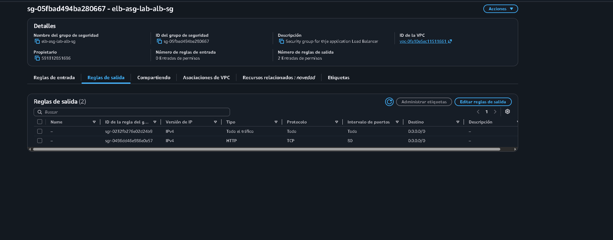
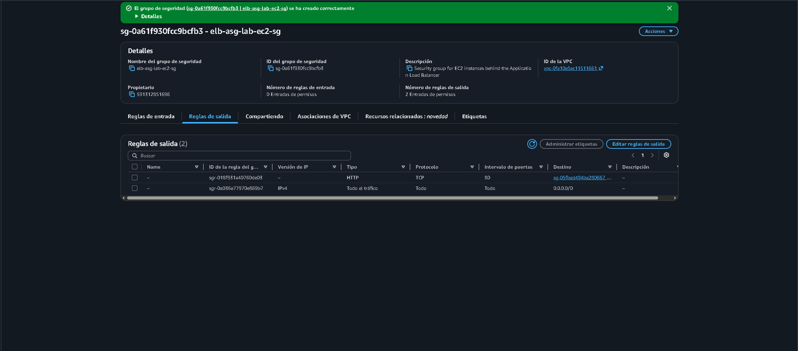
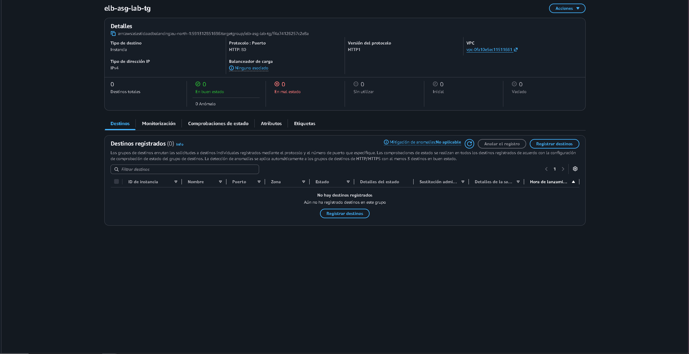
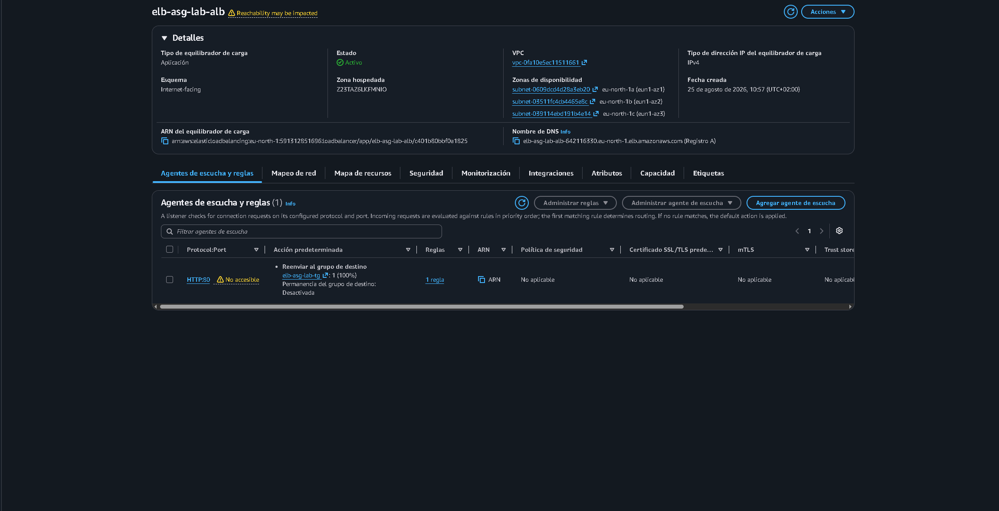
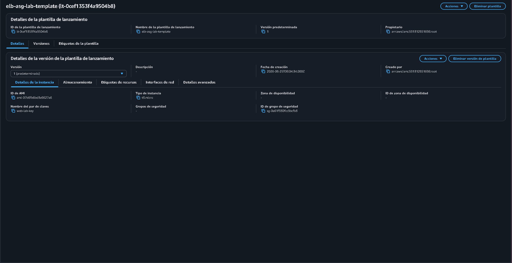
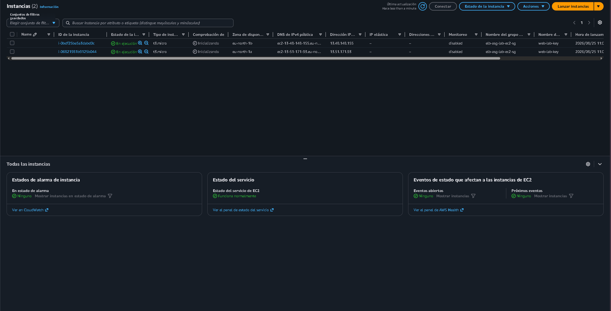
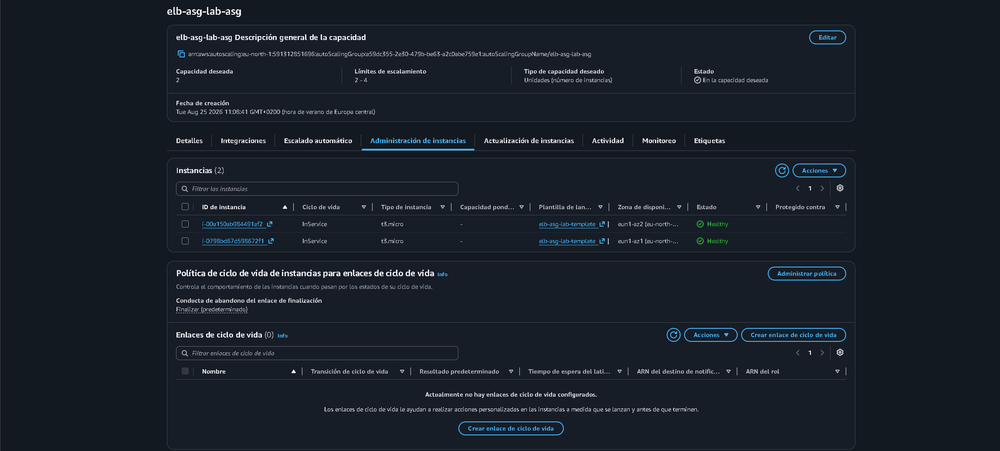
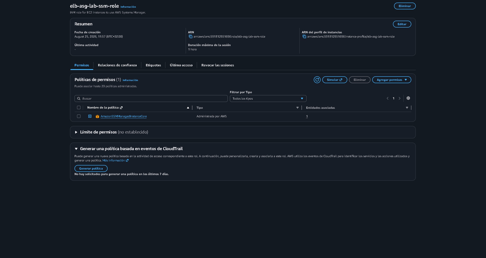

# Evidence

## 1. ALB Security Group

The ALB Security Group allows inbound HTTP traffic on port 80 from the Internet.

## 2. EC2 Security Group

The EC2 Security Group allows HTTP traffict from the Application Load Balancer Security Group.

## 3. Target Group

The target group contains the EC2 instances and performs HTTP health checks on port 80.

## 4. Application Load Balancer 

The application Load balancer is configured with an HTTP listener on port 80 and forwards traffic to the target

## 5. Launch Template

The Launch Template defines the configuration used to launch EC2 instances, including the Amazon Linux 2023 AMI, IAM role, Security Group and User Data.

## 6. Auto Scaling Group

The Auto Scaling Group maintains the required EC2 capacity and manages the instances registered with the Target Group.

## 7. Auto Scaling Replacement

After terminating an EC2 instance, the Auto Scaling Group automatically launched a replacement instance.

## 8. IAM and Systems Manager

The EC2 instances use an IAM role that allows management through AWS Systems Manager Session Manager.

## 9. ALB Application Test

The application was successfully accessed through the Application Load Balancer DNS name.

# The final environment provides a highly available web application where traffic is distributed across healthy EC2 instances and failed instances can be automatically replaced by the Auto Scaling Group.
